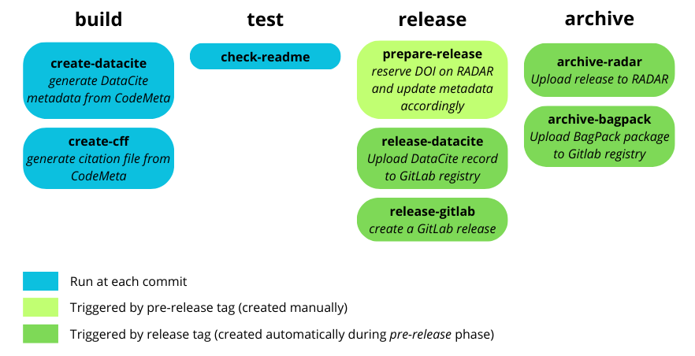

<!-- From the directory containing this file, you can build paper.pdf using Docker:
docker run --rm \
    --volume $PWD:/data \
    --user $(id -u):$(id -g) \
    --env JOURNAL=joss \
    openjournals/inara
 -->

# Summary

The FACILE-RS (Findability and Accessibility through Continuous Integration with Less Effort for Research Software) Python package facilitates the archival and long term preservation of research software repositories. It consists of a set of scripts, which simplify the maintenance of software metadata by automating its generation and synchronization in various formats from a single manually maintained metadata file. FACILE-RS also makes it easier to publish and archive software releases according to the Open Science paradigm and the FAIR (Findable, Accessible, Interoperable, Reusable) principles for Research Software by offering tools to automate the creation of releases and the upload to persistent research data repositories.

In particular, FACILE-RS automates:

* Creating a DataCite record [@DataCite2021] based on CodeMeta files [@Boettiger2017] present in repositories
* Creating a CFF (Citation File Format) file [@Druskat2021CFF] from CodeMeta files
* Creating archive packages in the BagIt [@rfc8493] or the BagPack [@rda2019bagpack] formats
* Creating a release on the GitLab development platform using the GitLab API
* Archiving software releases persistently on Zenodo
* Archiving software releases persistently using the RADAR service [@ijgi5030028]
* Using content from Markdown files, BibTeX files, or Python docstrings to create web pages within the [Grav CMS](https://getgrav.org/)

While the scripts can be run manually, they are designed to be used within GitLab CI/CD or another workflow automation system to automate the process of maintaining metadata and creating persistent software releases.

# Statement of need

Research software development is a fundamental aspect of academic research [@anzt2021sustainable],
and it has now been acknowledged that the FAIR principles (Findable, Accessible, Interoperable,
Reusable [@wilkinson2016fair]), historically established to improve the reusability of research data, should also be applied to research software. However, specific aspects of research software like executability or evolution over time require these guidelines to be adapted. Therefore, the FAIR principles for Research Software (FAIR4RS) have been introduced [@ChueHong2021FAIR].

In particular, reproducible research requires software and associated metadata to be easily findable by both machines and humans, and retrievable via standardised communication protocols.
In this context, several metadata standards are widely used across the scientific community:

* The Citation File Format (CFF) is a human- and machine-readable format that indicates how to cite software.
* The DataCite Metadata Schema consists of core metadata properties selected for accurate and consistent identification of research outputs for citation and retrieval purposes, with instructions for recommended use.
* CodeMeta [@jones2017codemeta], an extension of Schema.org, is a JSON and XML metadata schema for scientific software that aims to standardize the exchange of software metadata across repositories and organizations. In particular, it provides mappings between metadata fields used by a large range of software registries and package managers.

All of these standards serve specific purposes, and several are required to cover the whole software lifecycle. However, maintaining multiple metadata files in different formats can be a significant burden for research software developers, and an obstacle to the adoption of good software publication practices. In addition, as the content of the different metadata files is largely overlapping, maintaining these files manually can pose a risk to data consistency.

Another requirement for FAIR scholarly software is that all software releases are published according to the FAIR4RS principles, and assigned a persistent identifier. This can be tedious and prone to errors without an automated process.

Some initiatives were taken in order to overcome these difficulties. For instance, the HERMES project [@druskat2022software] allows to create automated workflows to gather metadata from various sources and publish software on repositories based on InvenioRDM (i.e. Zenodo). The metadata conversion utility Bolognese [@fenner2017bolognese] supports many metadata formats including CodeMeta and DataCite.

With FACILE-RS, we aim to provide a tool, which makes it easy to automate both the creation and maintenance of different metadata formats associated to research software, as well as the publication of software releases according to the FAIR4RS principles on reputable research data repositories.

FACILE-RS has already been integrated in several research software projects such as the openCARP electrophysiology simulator [@openCARP2024v15; @PLANK2021106223], the 3D visualizer meshalyzer [@Vigmond2023meshalyzer]  and DIVAID [@Goetz2023DIVAID], a tool to divide clinically important regions in bi-atrial geometries.

# Functionality

The main prerequisite for using FACILE-RS in a software repository is a CodeMeta metadata file, which can for example be generated using the [CodeMeta generator](https://codemeta.github.io/codemeta-generator/).

FACILE-RS scripts can be run using the `facile-rs` command line tool. The available commands are detailed in \autoref{tab:cluster}. While each of these commands can be executed individually and manually, FACILE-RS was designed to be used within an automated workflow like GitLab CI/CD pipelines, used for automating software development workflow via a continuous and iterative process.

\begin{table}[!ht]
\vspace{5mm}
\centering
\caption{\small Components of FACILE-RS}.\label{tab:cluster}
\begin{tabular}{ll}
\hline
Script & Functionality \\
\hline
\texttt{facile-rs cff create}              & generates Citation File Format (CFF) metadata file \\
\texttt{facile-rs datacite create}         & generates DataCite metadata file \\
\texttt{facile-rs bag create}              & creates BagIt package \\
\texttt{facile-rs bagpack create}          & adds DataCite XML to BagIt package \\
\texttt{facile-rs release prepare}         & updates \textit{version} and \textit{dateModified} fields in metadata \\
\texttt{facile-rs gitlab publish}          & creates release in GitLab \\
\texttt{facile-rs radar prepare}           & reserves DOI on RADAR \\
\texttt{facile-rs radar upload}            & creates archive and uploads it to RADAR\\
\texttt{facile-rs zenodo prepare}           & reserves DOI on Zenodo \\
\texttt{facile-rs zenodo upload}            & creates archive and uploads it to Zenodo\\
\texttt{facile-rs grav markdown}  & updates Grav CMS website \\
\texttt{facile-rs grav bibtex}    & converts BibTeX files and publishes references on \\
 & Grav CMS website \\
\texttt{facile-rs grav docstring} & extracts docstrings from Python scripts and publishes \\
 & them on Grav CMS website \\
\hline
\end{tabular}
\vspace{5mm}
\end{table}

A typical GitLab CI/CD workflow for FACILE-RS is illustrated in \autoref{fig:facile-rs-workflow}. In this example, each time a commit is published, the different metadata files are automatically updated from the CodeMeta file.

{ width=95% }

This workflow also includes an automated process for creating software releases, both on GitLab and on the research repository RADAR, which is triggered by creating a _pre-release_ tag (e.g. tag `pre-v0.1.0` for triggering the pipelines to create release `v0.1.0`). During the _pre-release_ phase, a DOI is reserved on RADAR and the software metadata associated with the release is updated. Then, the proper release tag as well as the GitLab and RADAR releases are created automatically.

For more information on the implementation of such workflows, we refer to [the tutorials](https://facile-rs.readthedocs.io/en/latest/tutorials/index.html) provided in the FACILE-RS documentation.

# Conclusion

In this paper, we present FACILE-RS, a tool to facilitate research software metadata management and archival. FACILE-RS helps researchers to follow the FAIR principles for research software through a set of scripts, which can be easily deployed within CI/CD workflows.

# Acknowledgements

This work was supported by KIT Strategy Fund Project "FAIR-RS" and the European High-Performance Computing Joint Undertaking EuroHPC under grant agreement No 955495 (MICROCARD) co-funded by the Horizon 2020 programme of the European Union (EU) and the German Federal Ministry of Education and Research.

# References
